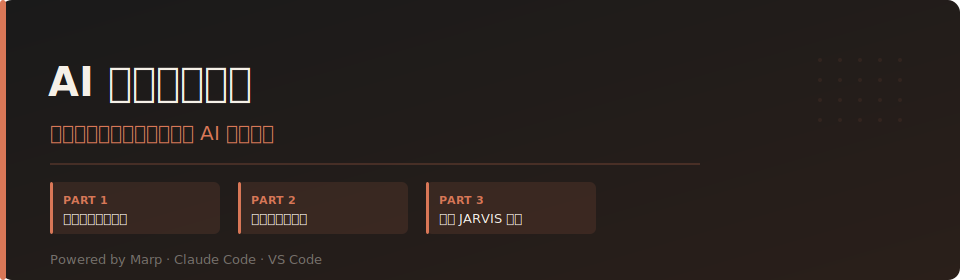

# AI 素質養成課程

**為白領上班族設計的三部曲 AI 實戰課程**

這套課程以 Marp 簡報格式製作，目標是讓每一位每天在電腦前工作的人，都能真正把 AI 當成自己的工作夥伴——不需要寫程式，不需要技術背景。

---

## 課程結構

| Part | 標題 | 核心主題 | 檔案 |
|------|------|----------|------|
| **Part 1** | 認識你的工作夥伴 | AI 素質養成基礎概念 | `AI 素質養成入門課 — 為白領上班族設計.md` |
| **Part 2** | 個人電腦新情境 | 從文書處理機到 Agent 控制台 | `AI 世代的個人電腦新情境 — 從文書處理機到 Agent 控制台.md` |
| **Part 3** | 啟動 JARVIS 模式 | 用 Claude Code 指揮真實工作 | `AI 啟動 JARVIS 模式 — 用 Claude Code 指揮真實工作.md` |

### Part 1 — 認識你的工作夥伴

AI 基礎概念的白話版講解：神經網路、預訓練、對齊、微調、推論、MoE、Token、無狀態與多輪對話、系統提示、工具呼叫、多模態。

### Part 2 — 個人電腦新情境

建立現代 AI 工作環境：VS Code、Markdown、Marp、Claude Code、Git、Agentic Coding。

### Part 3 — 啟動 JARVIS 模式

真實工作場景的 AI Agent 執行實作，學會「指揮」而不只是「使用」AI。

---

## 其他教材

| 檔案 | 說明 |
|------|------|
| `ai_course_intro.md` | 課程開場白：給所有參與者的一封信 |
| `ai_policy.md` | 公司 AI 使用政策：五項核心原則、核准工具規範、禁止事項與員工自我檢查清單 |
| `ai_policy.html` | AI 使用政策互動簡報（16 張投影片，可直接瀏覽器開啟） |
| `cpn_learning_path.md` | Claude Partner Network Learning Path：四門官方課程與合作夥伴認證指引（部分課程需程式基礎，適合技術人員） |
| `claude-code-agents.md` | Claude Code `←` 多 Agent 並行管理說明 |
| `Claude Code 執行 Git 操作.md` | Claude Code 搭配 Git 的環境設定參考 |

---

## 技術規格

- **簡報格式**：[Marp](https://marp.app/)（Markdown Presentation Ecosystem）
- **配色方案**：深色主題，背景 `#1A1A1A`，強調色 `#D97757`
- **互動展示**：純 HTML，無需伺服器，直接瀏覽器開啟

### 開啟簡報

安裝 VS Code 的 [Marp for VS Code](https://marketplace.visualstudio.com/items?itemName=marp-team.marp-vscode) 擴充套件後，開啟任一 `.md` 檔即可預覽或匯出為 PDF / HTML。

---

## 對象

這套課程為企業內訓設計，適合：
- 完全不懂程式的白領工作者
- 希望將 AI 導入日常工作流程的團隊
- 想了解 AI Agent 實際運作方式的主管或同仁
